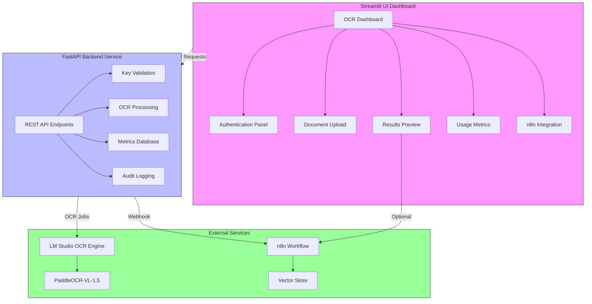
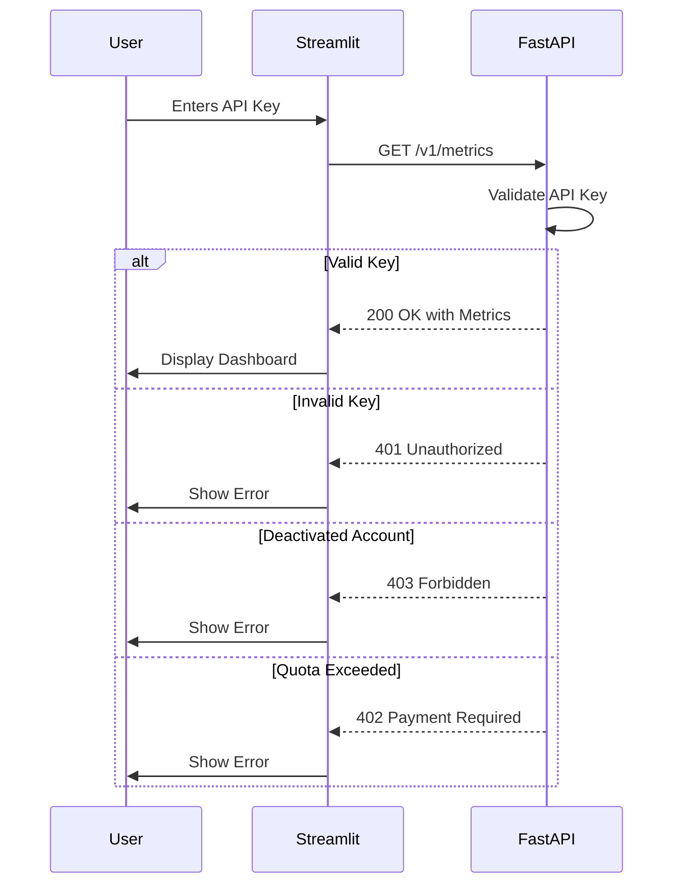
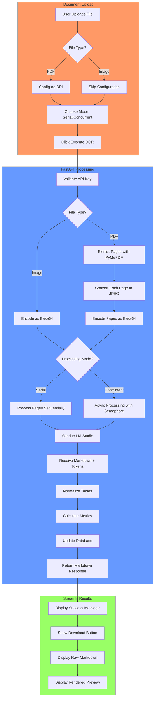
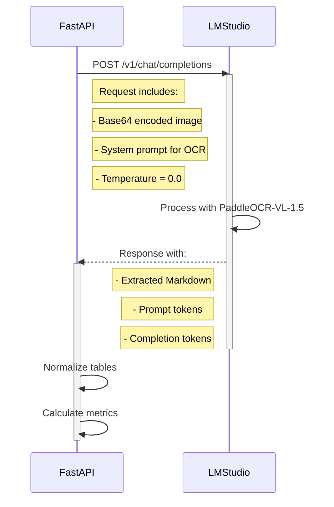
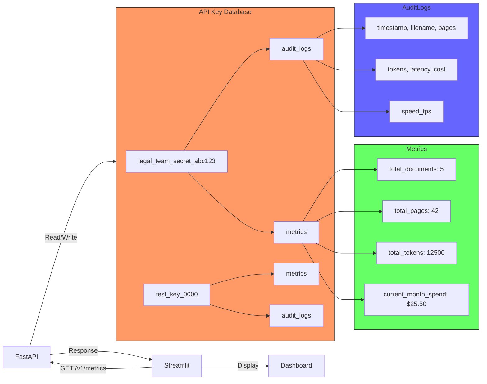
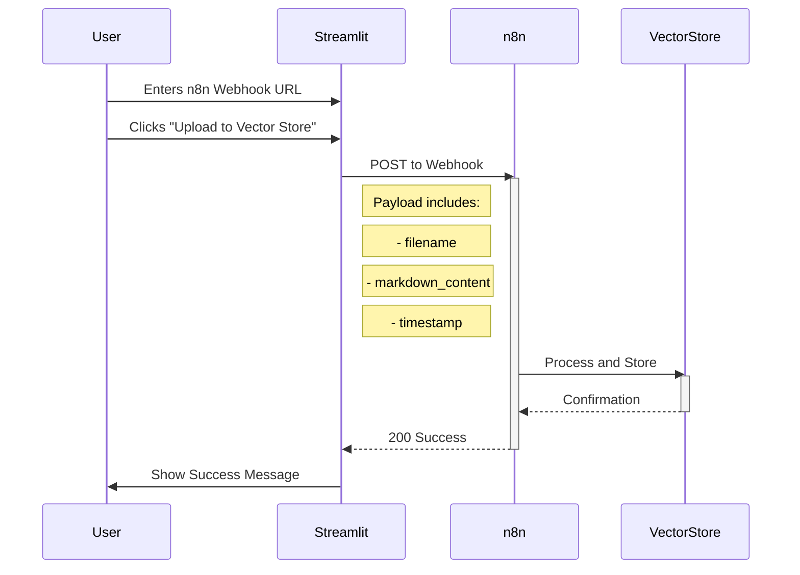
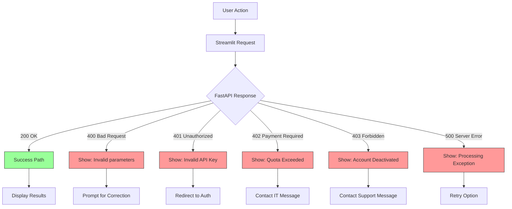
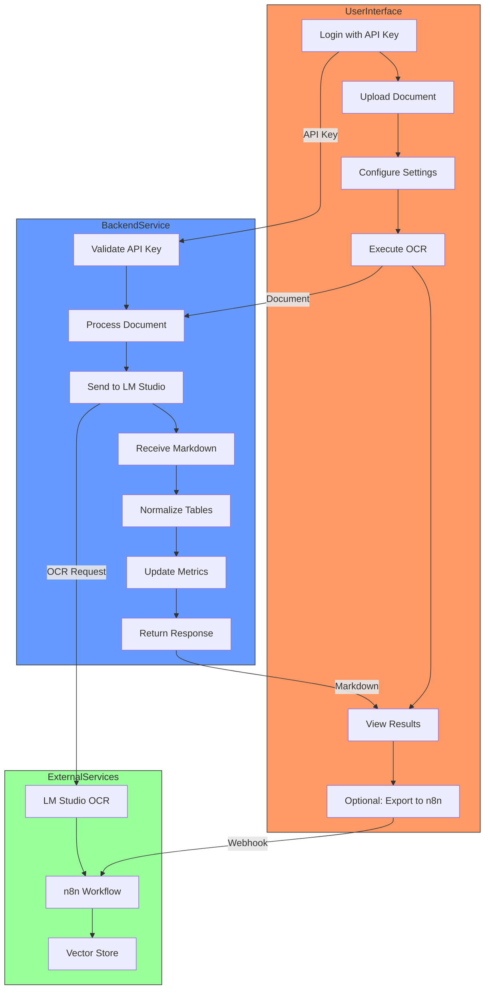

# OCR System Pipeline - Visual Documentation

## System Overview



## Authentication Flow



## Document Processing Pipeline



## OCR Processing Modes Comparison

```mermaid
stateDiagram-v2
    [*] --> ModeSelection
    
    state ModeSelection {
        [*] --> Decision
        Decision: Processing Mode
        Decision --> Serial: Choose Serial
        Decision --> Concurrent: Choose Concurrent
    }
    
    state Serial {
        [*] --> Page1
        Page1 --> Page2
        Page2 --> Page3
        Page3 --> [*]
        
        note right of Serial
            Pros:
            - Lower memory usage
            - More stable
            - Predictable performance
            
            Cons:
            - Slower for multi-page docs
        end note
    }
    
    state Concurrent {
        [*] --> Fork
        Fork --> Page1
        Fork --> Page2
        Fork --> Page3
        Page1 --> Join
        Page2 --> Join
        Page3 --> Join
        Join --> [*]
        
        note left of Concurrent
            Pros:
            - Faster processing
            - Better hardware utilization
            - Configurable concurrency (1-8)
            
            Cons:
            - Higher memory usage
            - More complex error handling
        end note
    }
    
    ModeSelection --> Serial
    ModeSelection --> Concurrent
```

## LM Studio Integration



## Metrics & Billing Flow



## n8n Integration Flow



## Error Handling Flow



## Performance Metrics Visualization

```mermaid
gauge
    title Processing Performance
    gauge "Tokens per Second" 85 0 100
    gauge "Concurrency Level" 3 0 8
    gauge "DPI Setting" 200 72 400
    gauge "Memory Usage" 60 0 100
```

## Complete System Flow



## Key Features Summary

### Processing Capabilities
- **File Types**: PDF, JPG, PNG
- **DPI Range**: 120-350 (default 200)
- **Processing Modes**: Serial or Concurrent
- **Concurrency**: 1-8 parallel pages (default 3)

### Table Recovery
- Two-pass OCR extraction
- Markdown table normalization
- Consistent column counts
- Empty cell filling

### Financial Controls
- Per-key monthly spend caps
- Real-time spend tracking
- Automatic quota enforcement
- Detailed cost auditing

### Monitoring & Telemetry
- Processing time tracking
- Tokens per second metrics
- Comprehensive audit logs
- Per-document cost calculation

### Integration Points
- LM Studio OCR Engine (Primary)
- n8n Workflow Automation (Optional)
- Vector Store (via n8n)
