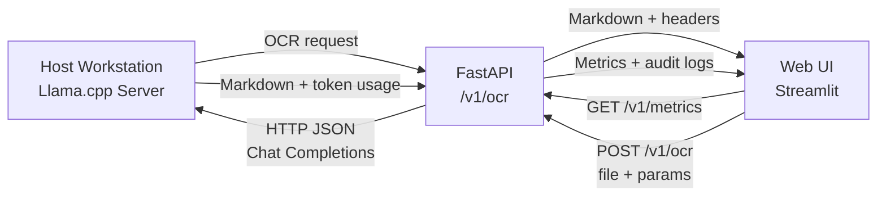

# OCR Flow Chart (Host Llama.cpp -> FastAPI -> Web UI)

```mermaid
flowchart LR
    A[Host Workstation
Llama.cpp Server] -->|OCR request| B[FastAPI
/v1/ocr]
    B -->|HTTP JSON
Chat Completions| A

    C[Web UI
Streamlit] -->|GET /v1/metrics| B
    C -->|POST /v1/ocr
file + params| B
    B -->|Markdown + headers| C

    A -->|Markdown + token usage| B
    B -->|Metrics + audit logs| C
```
