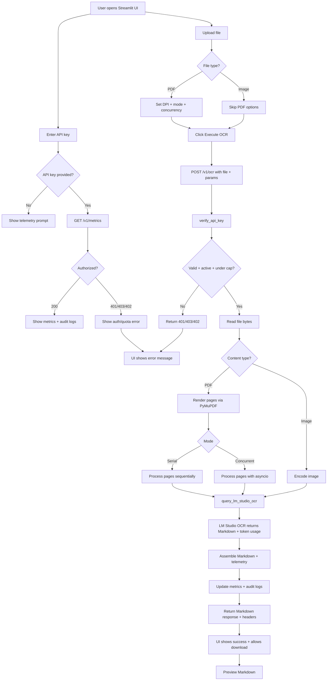

# OCR Flow Chart (05-25-26)

```mermaid
flowchart TD
    A[User opens Streamlit UI] --> B[Enter API key]
    B --> C{API key provided?}
    C -- No --> D[Show telemetry prompt]
    C -- Yes --> E[GET /v1/metrics]
    E --> F{Authorized?}
    F -- 200 --> G[Show metrics + audit logs]
    F -- 401/403/402 --> H[Show auth/quota error]

    A --> I[Upload file]
    I --> J{File type?}
    J -- PDF --> K[Set DPI + mode + concurrency]
    J -- Image --> L[Skip PDF options]
    K --> M[Click Execute OCR]
    L --> M
    M --> N[POST /v1/ocr with file + params]

    N --> O[verify_api_key]
    O --> P{Valid + active + under cap?}
    P -- No --> Q[Return 401/403/402]
    P -- Yes --> R[Read file bytes]

    R --> S{Content type?}
    S -- PDF --> T[Render pages via PyMuPDF]
    T --> U{Mode}
    U -- Serial --> V[Process pages sequentially]
    U -- Concurrent --> W[Process pages with asyncio]
    V --> X[query_lm_studio_ocr]
    W --> X
    S -- Image --> Y[Encode image]
    Y --> X

    X --> Z[LM Studio OCR returns Markdown + token usage]
    Z --> AA[Assemble Markdown + telemetry]
    AA --> AB[Update metrics + audit logs]
    AB --> AC[Return Markdown response + headers]

    AC --> AD[UI shows success + allows download]
    AD --> AE[Preview Markdown]
    Q --> AF[UI shows error message]
    H --> AF
```
